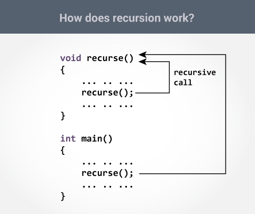

Recursion is a method in computer science that uses solutions of smaller instances of the same problem to find the solution to the original problem. In order to implement recursion in programs, we allow a function to call itself with in the program.

For this assignment, we developed five recursive methods for a user-inputted positive integer, and displayed them. Although recursion is hard to implement due to memory restraints, understanding the concept of recursion was helpful when later learning about algorithms in ICS 311.

Here is a great example of recursion in English I found on Stack Overflow:

<pre>
A child couldn't sleep, so her mother told her a story about a little frog,
    who couldn't sleep, so the frog's mother told her a story about a little bear,
         who couldn't sleep, so the bear's mother told her a story about a little weasel... 
            who fell asleep.
         ...and the little bear fell asleep;
    ...and the little frog fell asleep;
...and the child fell asleep.
</pre>

Source: <a href="https://stackoverflow.com/questions/3021/what-is-recursion-and-when-should-i-use-it"><what-is-recursion</a>

Source: <a href="https://github.com/mhsakuda/ICS-Projects/blob/master/Assignment%206/SakudaMitchell6.java"><i class="large github icon "></i>mhsakuda/ics-211-recursion</a>

